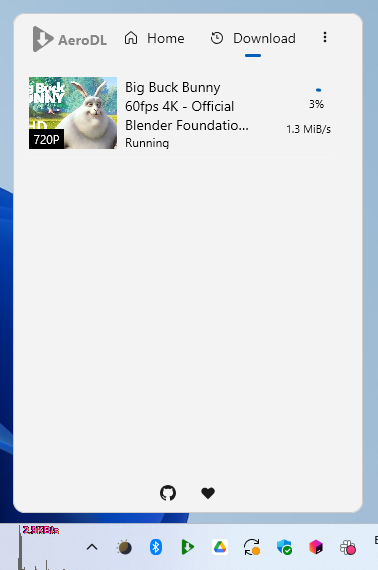

# 🚀 **AeroDL**

### The Modern YTDLP-DL GUI for Windows, macOS & Linux

> **AeroDL** is a sleek, cross-platform YouTube-DL frontend built with **JetBrains Compose Multiplatform**.
> It combines the power of `yt-dlp` with a beautiful, native-feeling interface for fast and reliable video & audio downloads.

---

## 🏠 **Home**

AeroDL welcomes you with a clean and minimal home screen.
Simply paste or detect a YouTube link — AeroDL automatically recognizes it and prepares everything for download.

<p align="center"></p>

---

## 🔔 **Smart Link Detection**

Instant notifications appear when a supported link is detected — open it directly in AeroDL or ignore.

<p align="center"></p>

---

## 🎬 **Video Info View**

Preview thumbnails, read descriptions, and choose between video or audio modes before confirming your download.

<p align="center"></p>

---

## 📥 **Download Manager**

Track all your downloads in real time — progress bars, speeds, sizes, and completion notifications.

<p align="center"></p>

---

## ⚙️ **Settings Panel**

Easily customize AeroDL to your workflow:
choose your browser cookies, naming presets, threads, parallel downloads, and thumbnail embedding.

<p align="center"></p>

---

## 🪄 **Key Features**

* 🎯 **Smart link detection** — detects YouTube links from clipboard or browser.
* 🎵 **Audio & Video modes** — download MP3s or full HD/4K videos with tags.
* ⚙️ **Highly configurable** — presets, naming, threads, parallel jobs.
* 🍪 **Browser cookies integration** — import from Firefox, Chrome, etc.
* 🖥️ **Cross-platform** — works on **Windows**, **macOS**, and **Linux (KDE/GNOME)**.
* 💡 **Modern interface** — animated transitions, fluent design, dark mode.
* 🧩 **Powered by ComposeNativeTray** — lightweight native tray integration.

---

## 🧠 **How It Works**

1. **Paste or detect a link** — AeroDL automatically catches YouTube URLs.
2. **Fetch metadata** — title, duration, formats, and thumbnail.
3. **Select quality & mode** — video or audio, preset or manual.
4. **Download instantly** — see speed and progress in real time.
5. **Enjoy** — open the downloaded file or folder directly from the tray.

---

## ⚙️ **Technical Stack**

* **Kotlin Multiplatform (JVM)**
* **JetBrains Compose Desktop**
* **Yt-DLP** — backend engine
* **FFmpeg** — conversion and tagging
* **ComposeNativeTray** — native tray integration
* **Ktor** — secure networking
* **Fluent Material UI** — clean, responsive interface

---

## 🧩 **Platform Support**

| Platform             | Status   | Notes                                      |
| -------------------- | -------- | ------------------------------------------ |
| 🪟 Windows 10+       | ✅ Stable | MSI installer via GitHub Releases          |
| 🍎 macOS 13+         | ✅ Stable | PKG installer via GitHub Releases          |
| 🐧 Linux (GNOME/KDE) | ✅ Stable | DEB package via GitHub Releases            |

---

## 📦 **Installation**

Official distribution: GitHub Releases

Get the latest version from the Releases page:
- https://github.com/kdroidFilter/AeroDL/releases/latest

* Windows → MSI installer
* macOS → PKG installer
* Linux → DEB package

For testing or development:

```bash
git clone https://github.com/kdroidFilter/AeroDL
cd AeroDL
./gradlew run
```

---

## ❤️ **Support & Feedback**

AeroDL is open source and constantly evolving.
If you like it:

* ⭐ **Star** the project on [GitHub](https://github.com/kdroidFilter/AeroDL)
* 🐛 **Report bugs or suggest features** via [Issues](https://github.com/kdroidFilter/AeroDL/issues)
* 💬 **Share screenshots & feedback** to help improve it!

---

## 📄 **License**

This project is licensed under the **GPL-3.0 License** — see the LICENSE file for details.
